=============
Sample charts
=============

All of the charts on this page were produced by fever.

Simple
======

Lines
-----

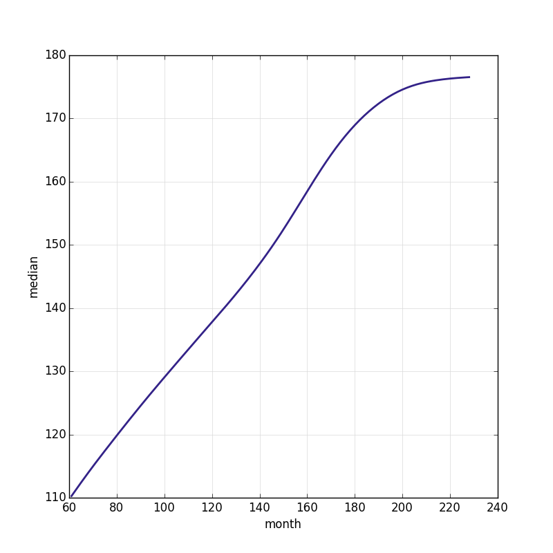

Columns
-------

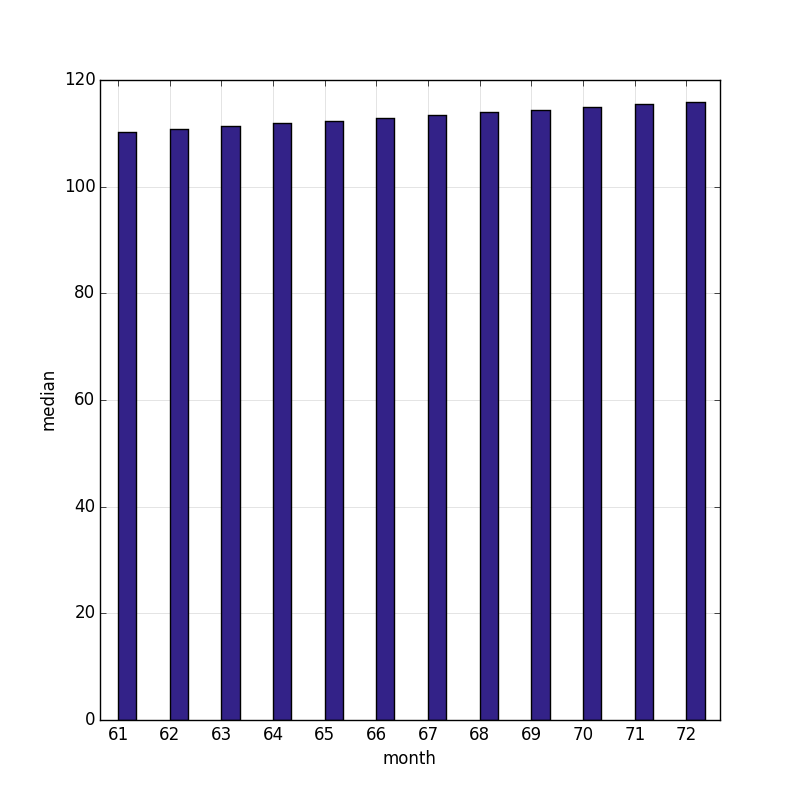

Bars
----

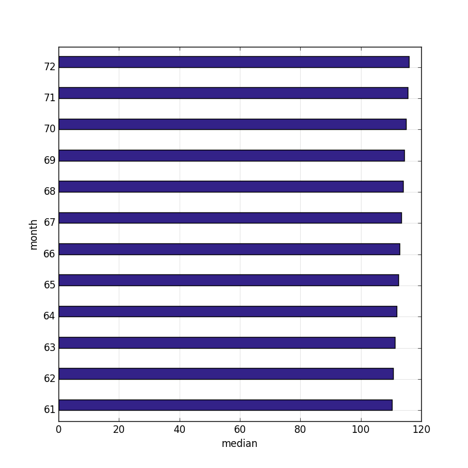

Scatter
-------

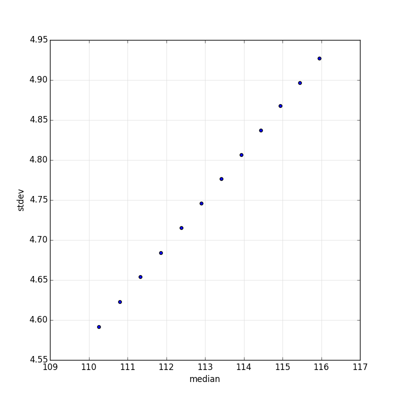

Multiple series
===============

Lines
-----

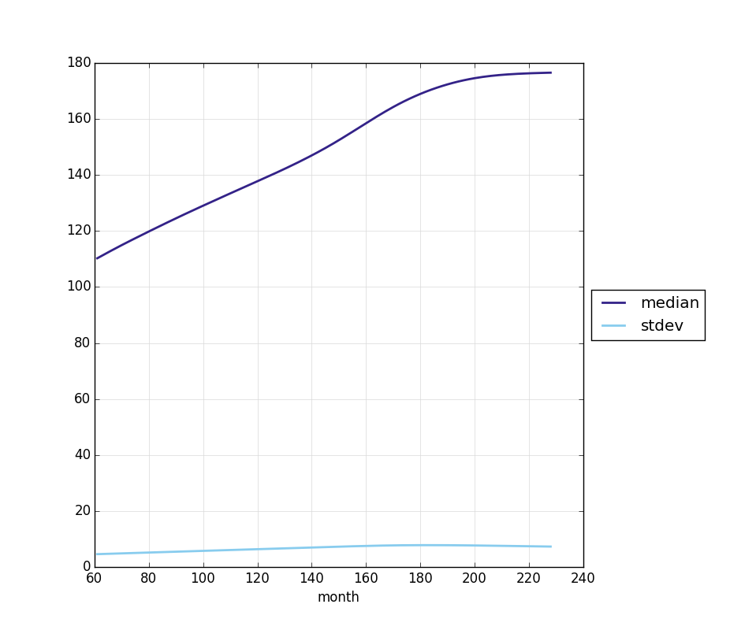

Columns
-------

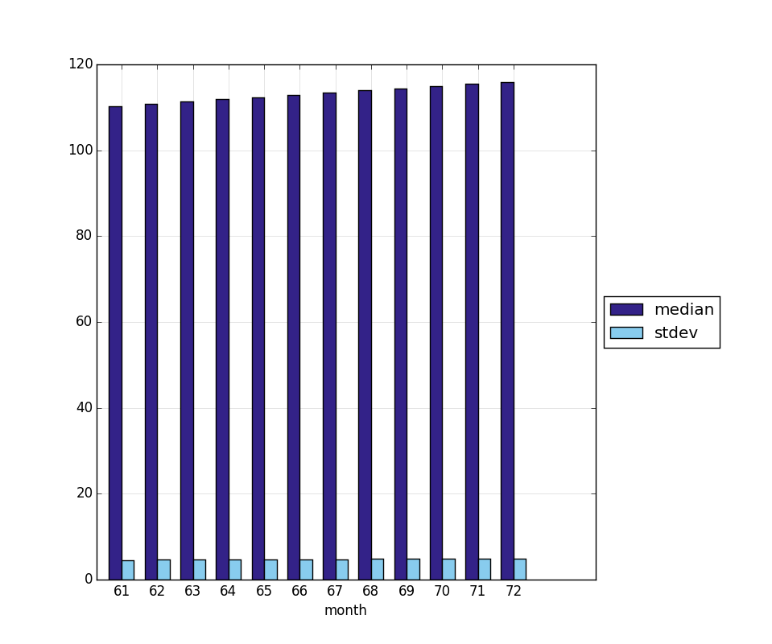

Bars
----

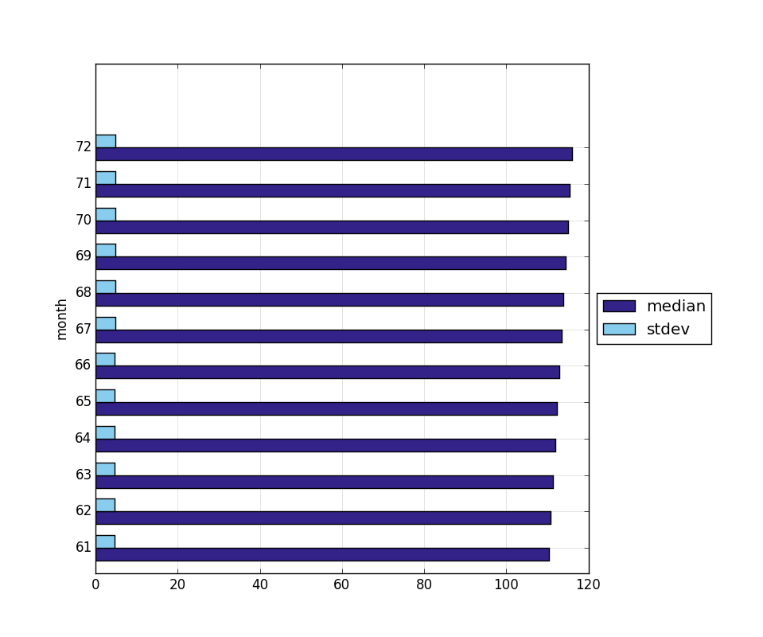

Small multiples
===============

Lines
-----

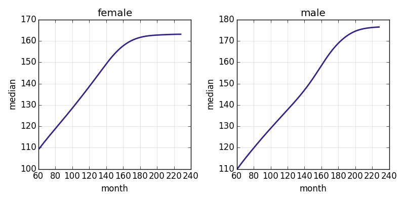

Columns
-------

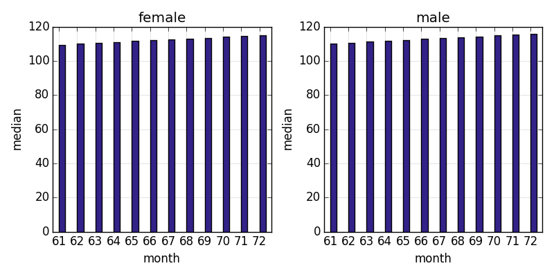

Bars
----

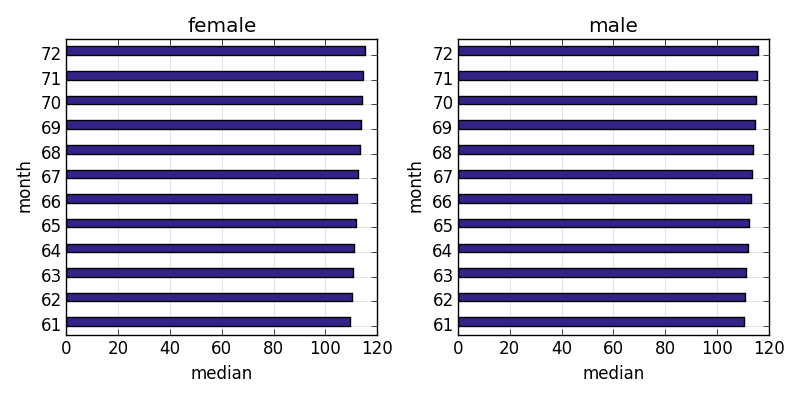

Scatter
-------

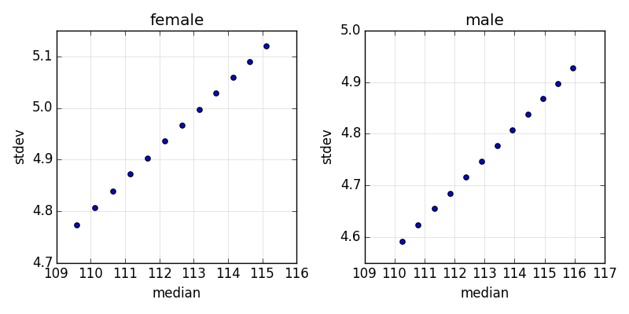

Small multiples and multiple series
===================================

Lines
-----

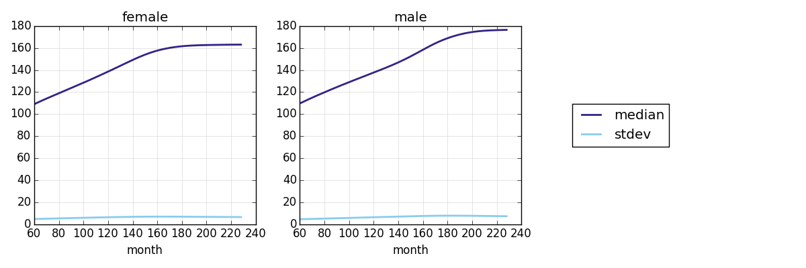

Columns
-------

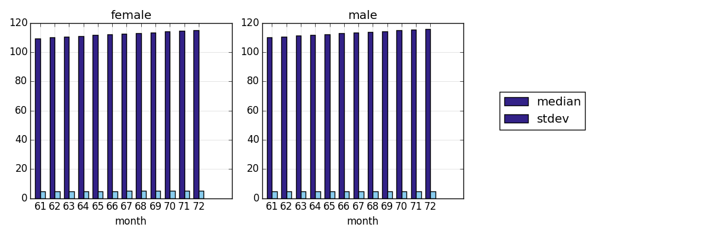

Bars
----

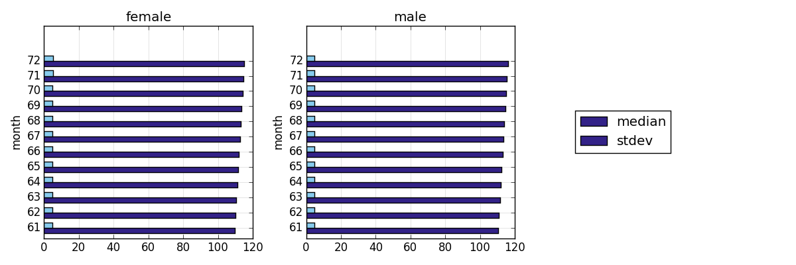
